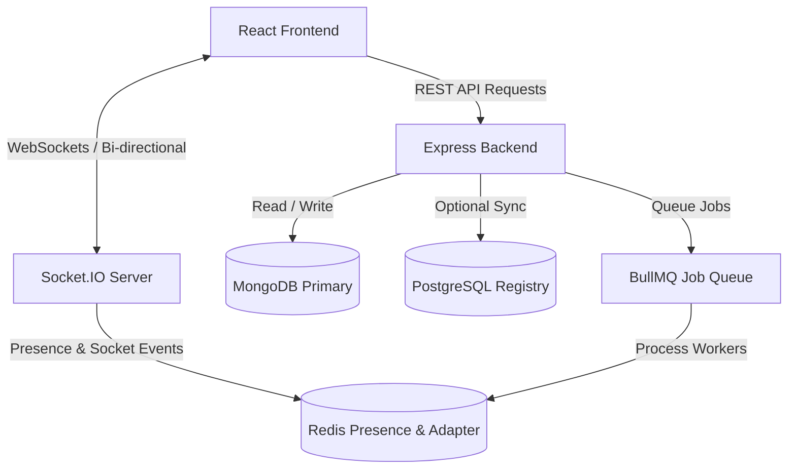
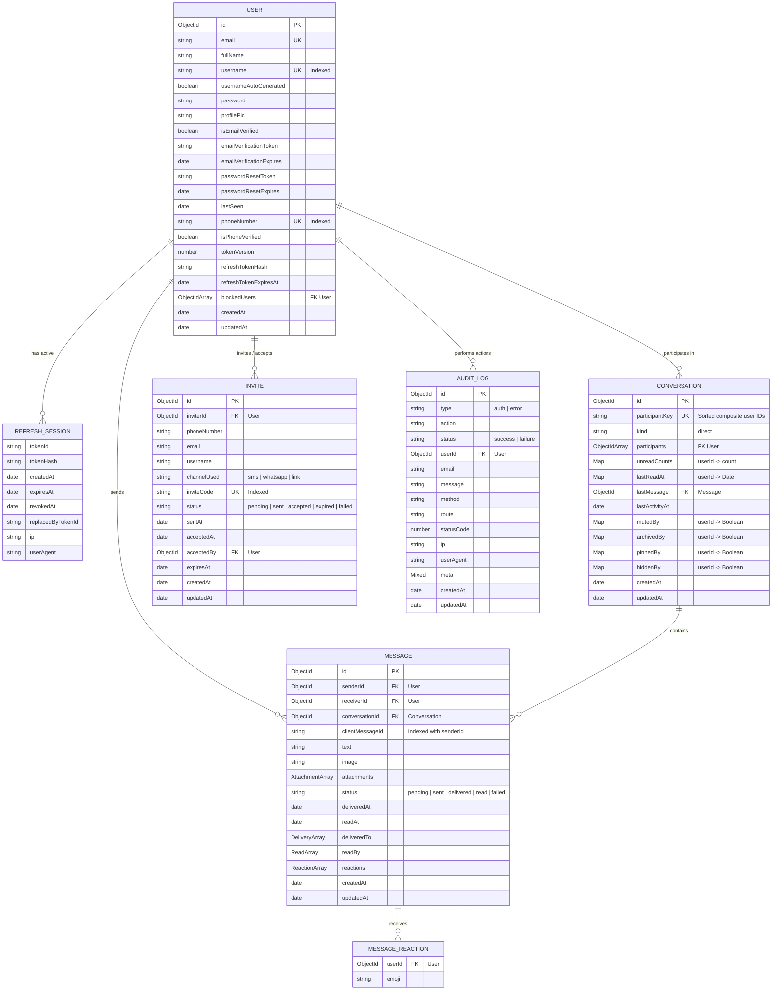
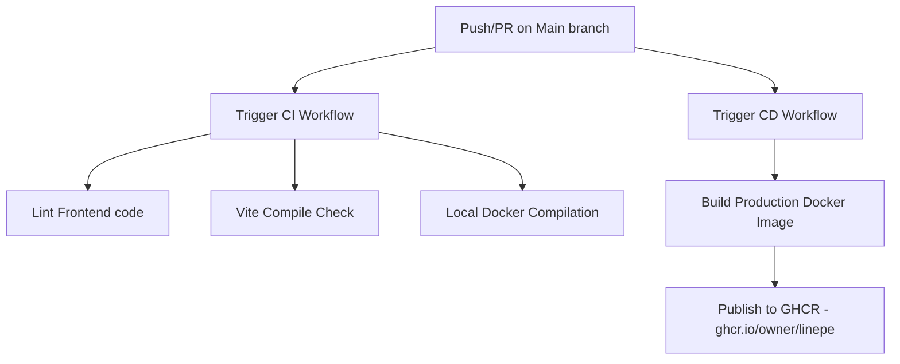

# LinePe

LinePe is a full-stack, real-time messaging application designed for high-performance direct conversations. Built with a modern tech stack comprising React 19, Vite, Express 5, MongoDB, Redis, and Socket.IO, LinePe delivers instant message delivery, live presence tracking, typing indicators, image/file attachments, security-first session management, and robust administrative logging.

---

## Features

- **OTP-Based Authentication**: Email-based signup and login secured with OTP verification.
- **Advanced Session Management**: Cookie-based JWT authentication with access token validation and rotating refresh tokens, allowing users to track and revoke active device sessions.
- **Real-Time Engine**: Socket.IO-driven message delivery, instant typing status, and real-time read/delivered status updates.
- **Horizontal Scaling Ready**: Powered by Redis Pub/Sub socket adapter for reliable event dispatching across distributed server nodes.
- **Media Attachments**: Multi-file attachment and profile image uploading directly integrated with Cloudinary.
- **User Discovery & Invites**: Simple search filters to find registered users and dynamic token-based invite links for external sharing.
- **Operational Auditing**: Detailed internal logging system track authentication attempts, operational events, and system errors.
- **System Health Metrics**: Dedicated metrics endpoint showcasing real-time service status (MongoDB, Redis) and runtime snapshots.

---

## Tech Stack

| Layer | Technologies |
| :--- | :--- |
| **Frontend** | React 19, Vite, Tailwind CSS 4, DaisyUI, Zustand, Axios, Socket.IO Client, React Router 7 |
| **Backend** | Node.js, Express 5, Socket.IO, BullMQ, Nodemailer, Helmet, CORS, Express Rate Limit |
| **Databases** | MongoDB (with Mongoose ORM), PostgreSQL (optional user metadata sync), Redis (adapter & presence) |
| **Hosting & Cloud** | Cloudinary (Media storage), Vercel (Frontend), Docker, Kubernetes |

---

## Project Structure

```text
.
├── .github/                  # CI/CD Workflows (CI check, CD image publisher)
├── backend/                  # Node.js + Express 5 + Socket.IO API
│   ├── src/
│   │   ├── constants/        # Socket event names and static types
│   │   ├── controllers/      # Route request handler logic
│   │   ├── jobs/             # BullMQ background workers (notifications)
│   │   ├── lib/              # Database connection, mailers, socket handlers, Redis presence stores
│   │   ├── middleware/       # JWT auth guards, rate limiting, error handlers, upload helpers
│   │   ├── models/           # Mongoose Database schemas (User, Message, Conversation, etc.)
│   │   └── routes/           # Express endpoint router definitions
│   └── package.json
├── frontend/                 # React 19 Client SPA
│   ├── src/
│   │   ├── app/              # Router layout wrapper components
│   │   ├── components/       # Reusable UI widgets (chat panels, sidebar, modals)
│   │   ├── lib/              # Client-side Socket connections, axios wrappers
│   │   └── store/            # Zustand global state (Auth, Chat, Theme states)
│   └── package.json
├── k8s/                      # Production Kubernetes deployment manifests
├── Dockerfile                # Production multi-stage Docker build config
├── docker-compose.yml        # Orchestrates local development containers
└── vercel.json               # Vercel Single Page App routing rewrite configuration
```

---

# Architecture

LinePe leverages a hybrid real-time and HTTP architecture, designed for maximum resilience, responsive updates, and horizontal scalability.



### 1. Frontend & Client State
The React frontend uses **Zustand** to maintain global stores, avoiding prop drilling and separating UI components from network/business logic:
- `useAuthStore.js`: Handles authentication states, signup/login verification flow, current user check, profile updates, and active device sessions.
- `useChatStore.js`: Manages list of active conversations, selected chat, real-time message feeds, scrolling behaviors, message reactions, typing statuses, and file uploads.
- `useThemeStore.js`: Preserves user interface themes across reloads, interacting directly with DaisyUI styles.

### 2. Authentication, Security & Sessions
LinePe implements a dual-token JWT mechanism to secure endpoints:
- **Access Tokens**: Short-lived (stored in HTTP-Only cookies) containing `userId` and `tokenVersion`. Each request reads and verifies the token.
- **Refresh Tokens**: Long-lived, rotated on use, and hashed in MongoDB. The backend stores a `refreshSessions` array under the user document. If a user logs out from a single device, only that specific session object is removed. If a password is changed or the user clicks "Logout From All Devices," the `tokenVersion` is incremented, immediately invalidating all active access tokens.

### 3. Real-Time & Event Synchronization
- **Connection Isolation**: Upon connection, Socket.IO clients are authenticated via their `accessToken` cookie. If valid, the socket automatically joins a unique room based on the user ID (`user:<userId>`).
- **Presence Tracking**: A heartbeat interval registers users as online. LinePe uses a generic presence interface. In single-instance modes, it runs `InMemoryPresenceStore`. In production environments, it automatically scales via `RedisPresenceStore`, tracking active sockets in Redis.
- **Typing & Status Acknowledgements**: Typing triggers `typing_start` and `typing_stop` broadcasts to active conversation rooms. Message delivery status (delivered/read) is acknowledged through batch socket events that perform database updates and notify the original sender instantly.
- **Pub/Sub Scaling**: By configuring a `REDIS_URL`, the server initiates `@socket.io/redis-adapter` to distribute WebSocket events across multiple server processes or nodes.

### 4. Background Workers & Micro-tasks
- High-latency requests like sending email notifications or welcoming new users are offloaded using **BullMQ**.
- The main API thread schedules jobs onto Redis-backed queues, which are consumed asynchronously by background worker threads to keep HTTP response times low.

---

# ER Diagram

LinePe's database design balances document-oriented scalability in MongoDB with structural rigidity. Below is the Mermaid entity relationship layout detailing the collections.



---

# API Docs

The application backend mounts all endpoints under `/api`. Request and response bodies are formatted as JSON, and authenticated routes require valid cookie credentials (`accessToken` / `refreshToken`).

### 1. Authentication Endpoints (`/api/auth`)

| Method | Endpoint | Authentication | Description |
| :--- | :--- | :--- | :--- |
| `POST` | `/signup` | Public | Registers a new user account and dispatches an OTP verification code via email. |
| `POST` | `/signup/verify` | Public | Validates signup email + OTP. Activates the account and registers the session cookies. |
| `POST` | `/login` | Public | Authenticates credentials and issues `accessToken` & `refreshToken` cookies. |
| `POST` | `/forgot-password` | Public | Generates and sends a secure password reset token via email. |
| `POST` | `/reset-password/:token`| Public | Reset user password using the token sent to the email. |
| `POST` | `/logout` | Public | Deletes active cookies and invalidates current session. |
| `POST` | `/logout-all` | Protected | Invalidate all devices and session tokens globally by updating the user's `tokenVersion`. |
| `GET` | `/sessions` | Protected | List all active refresh token sessions containing IP, browser agent details, and token IDs. |
| `POST` | `/logout-device` | Protected | Remove a single refresh session from the active list, terminating that specific device's access. |
| `POST` | `/refresh` | Public | Consumes the refresh cookie to sign and return a brand-new access token cookie. |
| `POST` | `/refresh-token` | Public | Alias endpoint for refresh token rotation. |
| `POST` | `/send-verification-email`| Protected | Manually trigger a verification link to verify user email address. |
| `GET` | `/verify-email/:token`| Public | Verifies the user email via link verification token. |
| `GET` | `/check` | Protected | Returns the active user model object (excluding credentials). |
| `PUT` | `/update-profile` | Protected | Updates profile details (e.g. `profilePic` using Cloudinary upload response). |

### 2. Message & Conversation Endpoints (`/api/messages`)

| Method | Endpoint | Authentication | Description |
| :--- | :--- | :--- | :--- |
| `GET` | `/users` | Protected | Fetch a list of active users filtered for the main chat sidebar. |
| `GET` | `/conversations` | Protected | Get all conversations that the active user belongs to, complete with last activity. |
| `GET` | `/conversations/search` | Protected | Search matching conversations by user name or keyword query. |
| `POST` | `/conversations/:id/:flag` | Protected | Update boolean flags (e.g. `:flag` can be `pin`, `mute`, `archive`, `hide`). |
| `DELETE`| `/conversations/:id` | Protected | Permanently delete direct conversation and associated logs from user views. |
| `POST` | `/block/:id` | Protected | Toggle block status for a specific user ID. |
| `GET` | `/search/:id` | Protected | Search messages matching text queries within conversation `:id`. |
| `GET` | `/conversation/:id` | Protected | Retrieve all messages from conversation `:id`. |
| `POST` | `/conversation/send/:id`| Protected | Send text/attachments to conversation ID `:id`. |
| `POST` | `/conversation/:conversationId/message/:messageId/react`| Protected | Create or toggle an emoji reaction for a specific message. |
| `POST` | `/conversation/read/:id`| Protected | Mark all incoming messages in conversation `:id` as read. |
| `POST` | `/upload` | Protected | Upload attachment file to Cloudinary. Accepts `multipart/form-data`. |
| `GET` | `/:id` | Protected | *Legacy*: Fetch message history with user ID. |
| `POST` | `/send/:id` | Protected | *Legacy*: Send message to user ID. |
| `POST` | `/read/:id` | Protected | *Legacy*: Mark messages from user ID as read. |

### 3. Invite Endpoints (`/api/invites`)

| Method | Endpoint | Authentication | Description |
| :--- | :--- | :--- | :--- |
| `GET` | `/:code` | Public | Inspect validity and fetch metadata associated with invite code. |
| `POST` | `/:token/accept` | Protected | Accepts the invite token and establishes a relationship between inviter and receiver. |
| `POST` | `/redeem` | Protected | Alternate pathway for accepting token invites. |
| `POST` | `/` | Protected | Creates a new invite link targeted at email, phone, or generic distribution channels. |

### 4. User Endpoints (`/api/users`)

| Method | Endpoint | Authentication | Description |
| :--- | :--- | :--- | :--- |
| `GET` | `/public/:username` | Public | Retrieve public details (avatar, username, registration timestamp) of a profile. |
| `GET` | `/search` | Protected | Search for other registered users by username, email, or telephone. |
| `GET` | `/lookup` | Protected | Perform target verification lookup for invites. |

### 5. Administration & Audit Logs (`/api/logs`)

| Method | Endpoint | Authentication | Description |
| :--- | :--- | :--- | :--- |
| `GET` | `/` | Admin Only | Query operational auditing events (authentication attempts, errors, rate limits). |

### 6. Health & Status Endpoints

| Method | Endpoint | Authentication | Description |
| :--- | :--- | :--- | :--- |
| `GET` | `/api/health` | Public | Returns database connection states, process uptime, and system performance metrics. |

---

# Screenshots

This section presents structured wireframes of the user interface screens.

### 1. Authentication & OTP Verification
```text
+-----------------------------------------------------------------------+
|  LinePe Chat                                            [Theme Select]|
+-----------------------------------------------------------------------+
|                                                                       |
|                       +------------------------+                      |
|                       |   Verify your Email    |                      |
|                       |                        |                      |
|                       |  We sent an OTP to:    |                      |
|                       |  user@example.com      |                      |
|                       |                        |                      |
|                       |  [ * ] [ * ] [ * ]     |                      |
|                       |  [ * ] [ * ] [ * ]     |                      |
|                       |                        |                      |
|                       |  +------------------+  |                      |
|                       |  |   Verify OTP     |  |                      |
|                       |  +------------------+  |                      |
|                       |                        |                      |
|                       |  Didn't get code? Resend|                      |
|                       +------------------------+                      |
|                                                                       |
+-----------------------------------------------------------------------+
```

### 2. Main Chat Workspace
```text
+-----------------------------------------------------------------------+
| [LP] LinePe    [Search messages...]                [Settings] [Logout]|
+-----------------------------------------------------------------------+
| Chats           |  [Active User] Online                         [ ... ]|
| +-------------+ | +---------------------------------------------------+|
| | Search...   | |                                                     ||
| +-------------+ | |  [Other User] 10:42 AM                            ||
| | Alice       | |  Hey! Did you check out the new features?           ||
| | [Online]    | |                                                     ||
| |             | |  [You] 10:43 AM                                     ||
| | Bob         | |  Yes, real-time presence scaling is amazing! (Read) ||
| | [Offline]   | |                                                     ||
| |             | |  [Other User] is typing...                          ||
| | Charlie     | |                                                     ||
| | [Online]    | |                                                     ||
| |             | | +-------------------------------------------------+ ||
| |             | | | Type a message...                 [Attach] [Send]| ||
| +-------------+ | +-------------------------------------------------+ ||
+-----------------------------------------------------------------------+
```

### 3. Profile & Theme Customizer
```text
+-----------------------------------------------------------------------+
|  Profile Settings                                             [ X ]   |
+-----------------------------------------------------------------------+
|  +------------------+                                                 |
|  |     (Avatar)     |   Full Name: Alice Doe                          |
|  |   [Upload New]   |   Username:  alice.pe                           |
|  +------------------+   Email:     alice@example.com                  |
|                                                                       |
|  +-----------------------------------------------------------------+  |
|  | UI Theme Configuration                                           |  |
|  |                                                                 |  |
|  | (o) Light    ( ) Dark     ( ) Forest    ( ) Retro     ( ) Cyber  |  |
|  +-----------------------------------------------------------------+  |
|                                                                       |
|  +------------------+                      +-----------------------+  |
|  |   Save Changes   |                      |  Manage Device Logins |  |
|  +------------------+                      +-----------------------+  |
+-----------------------------------------------------------------------+
```

> [!NOTE]
> Actual visual layout implementations are styled with **Tailwind CSS 4** and **DaisyUI**, providing 32+ theme presets and responsive breakpoints for mobile, tablet, and desktop devices.
> Mockup assets and screenshots can be placed under the `/artifacts/` folder during deployment.

---

# Deployment

### 1. Local Deployment

#### Prerequisites
- **Node.js**: Version 22.x or above.
- **MongoDB**: Version 7.x running locally or a connection string to MongoDB Atlas.
- **Redis**: Optional, but required for background queues and WebSockets horizontal scaling.

#### Step 1: Install Dependencies
Install dependencies on both workspaces using the package scripts:
```bash
# Install backend dependencies
cd backend
npm install

# Install frontend dependencies
cd ../frontend
npm install
```

#### Step 2: Set Environment Configurations
Create a `backend/.env` file. Ref: [backend/.env.example](file:///c:/Users/admin/Desktop/LinePe/backend/.env.example):
```env
NODE_ENV=development
PORT=5000
MONGODB_URI=mongodb://localhost:27017/linepe
REDIS_URL=redis://localhost:6379
JWT_SECRET=supersecretaccesskeyforlocaldevelopmentonly
JWT_REFRESH_SECRET=supersecretrefreshkeyforlocaldevelopmentonly
SMTP_HOST=smtp.mailtrap.io
SMTP_PORT=2525
SMTP_USER=your_smtp_user
SMTP_PASS=your_smtp_pass
EMAIL_FROM=LinePe <no-reply@linepe.com>
```

#### Step 3: Run Database Seeds (Optional)
Populate the database with test profiles for verification:
```bash
cd backend
npm run seed:users   # Seeds general mock users
npm run seed:admin   # Seeds the administrative audit-log profile
```

#### Step 4: Run Dev Servers
Start the backend Express server:
```bash
cd backend
npm run dev
```
In a new terminal window, boot the frontend Vite dev server:
```bash
cd frontend
npm run dev
```

---

### 2. Vercel Deployment (Frontend)

The frontend React application is structured to deploy smoothly on **Vercel** via workspace configuration.

- Build commands and configurations are managed in the root [vercel.json](file:///c:/Users/admin/Desktop/LinePe/vercel.json):
  ```json
  {
    "version": 2,
    "buildCommand": "npm run build",
    "outputDirectory": "frontend/dist",
    "rewrites": [
      { "source": "/(.*)", "destination": "/index.html" }
    ]
  }
  ```
- Make sure to define the API endpoint by setting `VITE_API_URL` environment parameter on the Vercel dashboard pointing to the deployed backend.

---

# CI/CD

Continuous Integration and Delivery pipelines are managed through GitHub Actions.



### 1. Continuous Integration (`ci.yml`)
Runs on all pushes to `main`/`develop` and pull requests.
- **Node Environment Setup**: Installs Node 22.x and runs `npm ci` on both frontend and backend workspace targets with actions cache enabled.
- **Frontend Verification**: Runs static analysis (`npm run lint`) and compiling builds (`npm run build`).
- **Container Check**: Proactively runs local compilation of the application container image using:
  ```bash
  docker build -t linepe:ci .
  ```

### 2. Continuous Delivery (`cd.yml`)
Triggers strictly on commits merged into the `main` branch.
- **GHCR Logging**: Authenticates using the automatic workflow secret token against GitHub Container Registry (`ghcr.io`).
- **Buildx Orchestration**: Initializes Docker Buildx for performance optimizations.
- **Build & Push**: Builds the multi-stage Docker image and publishes tags:
  - `ghcr.io/owner/linepe:latest`
  - `ghcr.io/owner/linepe:<commit-sha>`

---

# Docker

LinePe uses multi-stage builds to optimize image sizes and deploy in unified containers.

### 1. Multi-Stage Dockerfile
The production [Dockerfile](file:///c:/Users/admin/Desktop/LinePe/Dockerfile) is segmented into three distinct steps:
1. **`frontend-builder`**: Restricts Node compiler footprint, downloads frontend dependencies, builds static SPA files, and outputs build files into `/app/frontend/dist`.
2. **`backend-deps`**: Installs production-only dependencies using `npm ci --omit=dev`.
3. **`runtime`**: Lightweight Alpine container containing production `node_modules`, backend files, and built static files from `frontend-builder`. Ports are exposed on `5000`, running `node src/index.js` as PID 1.

### 2. Docker Compose Config
For local production tests, [docker-compose.yml](file:///c:/Users/admin/Desktop/LinePe/docker-compose.yml) orchestrates four containers:
- **`mongo`**: Persistent database container on `27017` with healthy health check parameters.
- **`redis`**: Cache and Socket pub/sub service container running Alpine.
- **`postgres`**: Relational registry db template container.
- **`app`**: The application runtime container, depending on DB instances.
Run the multi-container environment:
```bash
docker compose up --build
```

---

# AWS

Deploying LinePe to AWS involves scaling the application tier and separating container state into fully managed serverless infrastructure.

```text
               [ AWS Route 53 (DNS) ]
                         |
           +-------------+-------------+
           | (Static Assets)           | (WebSockets & REST)
           v                           v
   [ CloudFront CDN ]         [ Application Load Balancer (ALB) ]
           |                           | (Sticky Sessions, Port 443)
           v                           v
     [ S3 Bucket ]            [ AWS ECS - Fargate Tasks ]
                                       |
                   +-------------------+-------------------+
                   |                   |                   |
                   v                   v                   v
            [ DocumentDB ]      [ RDS Postgres ]    [ ElastiCache Redis ]
```

### 1. Frontend Tier (S3 & CloudFront)
- **Asset Storage**: Upload Vite static build outputs (`/frontend/dist`) directly to an **Amazon S3** bucket configured for static web hosting.
- **CDN Distribution**: Serve the bucket content via **Amazon CloudFront** to provide low-latency caching, global edge distribution, and configure SSL/TLS via **AWS Certificate Manager (ACM)**.

### 2. Application Tier (ECS Fargate & ALB)
- **Container Registry**: Push the Docker image to **AWS ECR (Elastic Container Registry)**.
- **Compute**: Deploy ECR images as container tasks inside **AWS ECS** running on **AWS Fargate** (serverless, no EC2 instances to manage).
- **Load Balancer (ALB)**: Route traffic using an **Application Load Balancer**.
  > [!IMPORTANT]
  > Configure **Sticky Sessions** (cookie-based target group affinity) on the ALB. This ensures a client's WebSocket connection remains bound to the same backend container task unless that container scales down.
- **Secrets Management**: Read configurations from **AWS Secrets Manager** injected directly into ECS Task definition environment files.

### 3. Database Tier (RDS & DocumentDB)
- **MongoDB**: Provision **Amazon DocumentDB** (MongoDB compatible cluster) or utilize **MongoDB Atlas** with AWS private link setup.
- **PostgreSQL**: Spin up a multi-AZ instance of **Amazon RDS for PostgreSQL**.
- **Redis Cache & Pub/Sub**: Deploy a managed **Amazon ElastiCache for Redis** instance to coordinate multi-container Socket.IO events and process worker tasks.

### 4. VPC Networking
- Establish public and private subnets across multiple availability zones (AZs).
- Restrict database and Redis security groups to only accept inbound connections originating from the ECS security group.

---

# Live Link

The production deployment of LinePe's client application is accessible at:

### 🔗 [https://line-pe.vercel.app](https://line-pe.vercel.app)

> [!WARNING]
> When executing backend microservices, ensure the `CLIENT_URL` and `CLIENT_URLS` configurations include the live link domain. This prevents security errors related to Cross-Origin Resource Sharing (CORS) and cookies synchronization.

---

# Blog

Below is a technical write-up detailing the development and scaling architecture of LinePe.

---

## Scaling Real-Time Messaging to Millions of Active Users
### By the LinePe Engineering Team

When building modern chat experiences, developer tools often prioritize features over structural performance. In this article, we explore the challenges encountered while developing LinePe, focusing on state synchronization, secure session management, and horizontal scalability.

### The Real-Time Synchronization Dilemma
WebSockets provide high-frequency bi-directional channels, but they introduces memory and process boundary constraints. If a user is connected to Server Node A, how does Server Node B broadcast a message to them when their contact submits it?

We solved this in LinePe by integrating a Redis Pub/Sub adapter to coordinate events:

```text
User 1 (Node A) --------> Message Sent (REST API)
                               |
                               v
                       Backend Database
                               |
                               +-----> Broadcast (Redis Channel)
                                             |
                                             v
User 2 (Node B) <------ Socket Emit <--- Node B Receives Event
```

By decoupling API requests from socket broadcasts, we ensure that state modifications are safely persisted via MongoDB, while client notifications propagate globally across any number of backend servers.

### Bulletproof Sessions with Rotating Tokens
Security is paramount in real-time platforms. Relying solely on local storage tokens leaves users vulnerable to Cross-Site Scripting (XSS) attacks, while server-side session stores create bottlenecks.

LinePe solves this by storing short-lived access JWT tokens in secure, HTTP-only, SameSite cookies. To handle device sessions without checking database connections on every event request:
1. When logging in, the server stores a rotating `refreshToken` in the database within a `refreshSessions` array.
2. The user client is issued an access token with a short lifespan and a `tokenVersion` flag.
3. If a session is suspicious or the user chooses to "Logout from all devices," the backend increments the `tokenVersion` on the User schema.
4. On the next socket handshake or API call, the decoded token version will mismatch, immediately revoking access.

### Optimizing Async Pipelines
We integrated **BullMQ** to prevent heavy tasks (like sending validation OTPs) from blocking the Express event loop. Offloading these tasks to Redis-backed queues ensures that even during peak load, API responses remain below 50ms, resulting in a responsive, snappy chat interface.
